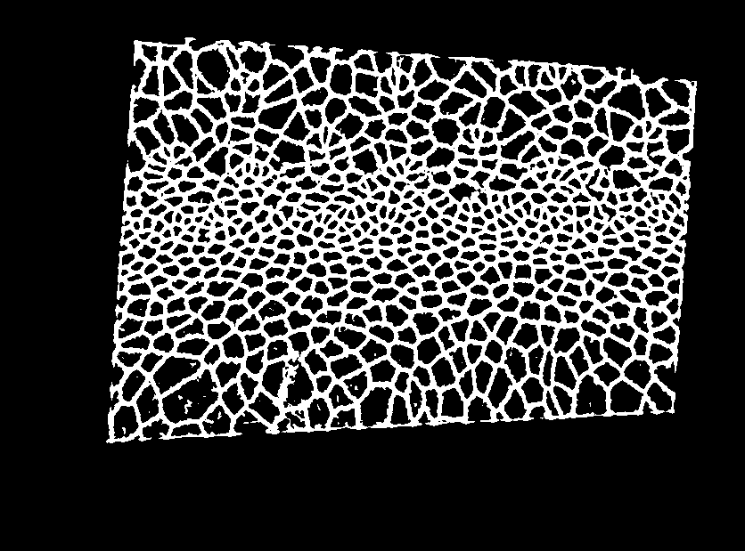
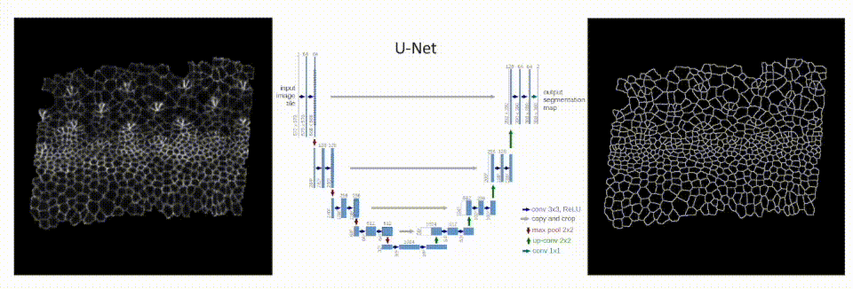
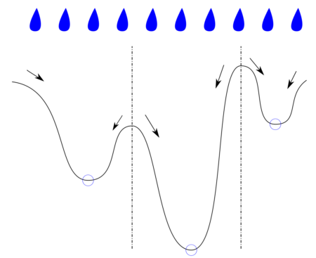
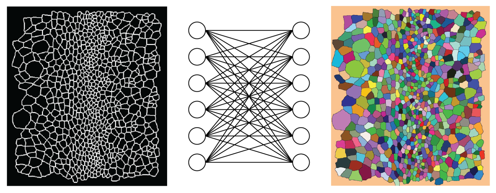

# eye-patterning 

## Table of Contents
- [Getting started](#getting-started)
- [Section 1: ANALYSIS_DRIVER.m](#section-1-analysis_driverm)
    - [Cell tracking](#cell-tracking)
    - [Annotation of cell classes](#annotation-of-cell-classes)
    - [Morphogenetic furrow location](#morphogenetic-furrow-location)
    - [Cell centroid velocity field](#cell-centroid-velocity-field)
    - [Ommatidial lattice annotation](#ommatidial-lattice-annotation)
    - [Ommatidial lattice annotation - column annotation](#ommatidial-lattice-annotation---column-annotation)
    - [Ommatidial lattice annotation - row annotation](#ommatidial-lattice-annotation---row-annotation)
- [Section 2: SEG_TRACKING_DRIVER.m](#section-2-seg_tracking_driverm)
    - [Surface projection using ImSAnE](#surface-projection-using-imsane)
    - [Pixel classification & segmentation](#pixel-classification--segmentation)
    - [Detect cells - watershed transform & bwlabel](#detect-cells---watershed-transform--bwlabel)
    - [Tracking - hungarian (munkres) algorithm](#tracking---hungarian-munkres-algorithm)
    - [Manual corrections - using the GUI](#manual-corrections---using-the-gui)
- [License](#license)

&nbsp;
&nbsp;
&nbsp;

# Getting started

This code is companion to the publication [link to bioRxiv](linkhere) and documents the data we've published, [Section 1: ANALYSIS_DRIVER.m](#section-1-analysis_driverm), as well as the pipeline we used to generate this data, [Section 2: SEG_TRACKING_DRIVER.m](#section-2-seg_tracking_driverm).

We recommend using [MATLAB R2018a](https://www.mathworks.com/products/new_products/release2018a.html). The [Image Processing Toolkit](https://www.mathworks.com/products/image.html) is required. Most of the code will run fine with newer versions of matlab. However, the GUI for manually correcting segmentation/tracking ('segmenter.m'/'segmenter.fig') was developed using GUIDE, which is becoming deprecated in newer versions of matlab.

Data can be downloaded [here](https://drive.google.com/drive/folders/1I-nRpn1esRzs5t4ztgbNvkBQuTN2vT7L?usp=sharing). Each dataset is stored as a matlab workspace that contains all the necessary information to run each block of code in 'ANALYSIS_DRIVER.m': Wildtype Replicate 1 can be found in 'wildtype1_data.mat', Wildtype Replicate 2 in 'wildtype2_data.mat', the strong _scabrous_ mutant in 'scabrous_strongMutant_data.mat', and the _weak_ scabrous mutant 'scabrous_weakMutant_data.mat'. Load the .mat files into matlab workspace and then use the driver file to get started with your analysis. Note, only Wildtype Replicate 1 contains the necessary annotations to run the sections pertaining to the ommatidial lattice annotation.

Additionally, the raw images and corresponding segmentation masks are also [available for download](https://drive.google.com/drive/folders/1I-nRpn1esRzs5t4ztgbNvkBQuTN2vT7L?usp=sharing). However, note that our tracking results cannot be perfectly replicated using the munkres assignment algorithm we used for cell tracking because we implemented manual changes to cell tracking via the 'segmenter' GUI. The exact tracking information we used in the publication is contained within the .mat files corresponding to each dataset.

A copy of ImSAnE (Image Surface Analysis Environment) is also included in this repository. You can also download it [here](https://github.com/idse/imsane) and read more about how the software works [here](https://www.nature.com/articles/nmeth.3648).

&nbsp;
&nbsp;
&nbsp;

# Section 1: ANALYSIS_DRIVER.m

The data we are publishing contains many more phenomena than the ones we've reported on. This driver file 'ANALYSIS_DRIVER.m' contains code demonstrating how to access our data and use the various data annotations we used to extract measurements from subpopulations of cells and/or different regions of interest in the tissue. We hope this code helps facilitate further analysis from researchers interested in expanding on our work or, even better, asking new questions entirely!

## Cell tracking

After [segmenting cells](#part-1-segmentation-and-tracking-seg_tracking_driverm), we use the [munkres assignment algorithm](#step-4-tracking---hungarian-munkres-algorithm) to map cells between adjacent time points. This is prerequisite before any additional analysis can be completed. This section of 'ANALYSIS_DRIVER.m' demonstrates how to display a representation of tracked cells via a color mask that uses a unique, random color to label each tracked object.

&nbsp;

## Annotation of cell classes

With cells segmented and tracked, we were able to annotate the identities of photoreceptor cells (R-cells) onto our data manually. Cell classes were easily determined by their unique morphology once they've differentiated on the posterior side of the morphogenetic furrow. These identities were then propegated backwards in time, allowing us to extract measurements of position, topology, and morphology from these cells before they were committed to these fates. This section of 'ANALYSIS_DRIVER.m' demonstrates how to access these cell class annotations and color in the cell area corresponding to each instance of a R-cell throughout the duration of the movie.

&nbsp;

## Morphogenetic furrow location

The morphogenetic furrow is the wavefront of differenetiation in this system. As it moves from the posterior to anterior margin of the eye imaginal disc, it triggers a wave of simultaneous cell differentiation and morphological changes. The position of the morphogenetic furrow is stored in a vector called 'furrow_position' that contains a value for every timepoint. This value refers to the position of the morphogenetic furrow, in pixels, along the anterior-posterior axis. This section of 'ANALYSIS_DRIVER.m' demonstrates how to access and plot the location of the morphogenetic furrow on top of each frame of the movie.

&nbsp;

## Cell centroid velocity field

The velocity field is calculated through central displacement of cell centroids over one hour of developmental time (each dataset has a frame rate of 5 minutes, so this is 12 frames of each movie). One hour was found to be the timescale over which deterministic behavior emerged. Using timesteps greater than an hour did not substantial change the behavior/organization of the velocity field, whereas using shorter time steps introduced additional noise to the organization of the velocity field. Note the strong cell flow in the morphogenetic furrow (red line) in the anterior direction (down), organized into an oscillating, periodic pattern.

The velocity field is stored in a matlab struct called 'Velocity' containing a set of matrices that describe the 1) x centroid coordinates, 2) y centroid coordinates, 3) x velocity components, and 4) y velocity components of the centroid based velocity field. Velocity also contains another set of four matrices that describes an interpolated version of the velocity field with 1µm grid spacing in both the anterior-posterior and dorsal-ventral directions. This section of 'ANALYSIS_DRIVER.m' demonstrates how to visualize the centroid velocity field using matlab's quiver function, with an option to display the interpolated velocity field instead.

&nbsp;

## Ommatidial lattice annotation

The ommatidial lattice emerges concurrently with the cell differentiation / local morphological changes triggered by passage of the morphogenetic furrow. A triangular lattice is dual to a hexoganl lattice, so what we are watching emerge here is the initial nucleation of the final ommatidial lattice, visible on the surface of the adult eye. We've recorded the coordinates of the lattice through a pair of connected matrices - one storing the list of triangles with regard to annotated R8s ('lattice_edges') and another describing the position of these points at each time point ('lattice_points_overTime'). This section of 'ANALYSIS_DRIVER.m' demonstrates how to visualize the ommatidial lattice, defined using the centroids of the R8 class photoreceptor cells, using matlab's patch function.

&nbsp;

## Ommatidial lattice annotation - column annotation

We define columns of ommatidia as being parallel to the morphogenetic furrow. In the publication, the morphogenetic furrow is oriented vertically with the anterior to the left and posterior to the right. Here, things are rotated 90 degrees and the morphogenetic furrow is horizontal with the anterior towards the bottom and posterior towards the top. Note how cells fated to belong to separate columns ommatidia posterior of the morphogenetic furrow are compressed into overlapping positions along the anterior-posterior axis inside the morphogenetic furrow. This section of 'ANALYSIS_DRIVER.m' demonstrates how to color in R-cells according to their column identity within the ommatidial lattice.

&nbsp;

## Ommatidial lattice annotation - row annotation

Similar to column identity, we can also define rows of ommatidia as being perpendicular to the morphogenetic furrow. This section of 'ANALYSIS_DRIVER.m' demonstrates how to color in R-cells according to their row identity within the ommatidial lattice.

&nbsp;
&nbsp;
&nbsp;

# Section 2: SEG_TRACKING_DRIVER.m

The goal of this driver file is to document the pipeline we used to process data for our publication, but also to lay the framework for others to process their own data. Unless you find a way to achieve perfect pixel classification (please message me if you do), this will unfortunately involve some manual correction. Improving imaging quality can save a lot of time in data processing: higher resolution, better signal-to-noise greatly improve segmentation quality. This driver file brings you from initial pixel classification using an external program (Ilastik or our custom trained CNN) through finding and tracking objects in your segmented images in matlab and using a GUI to discover and correct errors in your segmentation that lead to errors in cell tracking.

## Surface projection using ImSAnE

Microscopy data of epithelial tissue must be collected in 3D even though the adherens junction plane (where our fluorescent label that outlines cells is localized to) is approximately planar; this is because the adherens junction curves in the apical-basal dimension (z-axis). Therefore, before we can segment and track cells, we need to create a 2D projection of the adherens junction plane. To do this, we are going to use [ImSAnE (Image Surface Analysis Environment)](https://github.com/idse/imsane), an open source matlab software capable of detecting simple approximately planar surfaces, like our case here, or cyclindrical surfaces, such as the _Drosophila_ embryo.

We've included a copy of ImSAnE in our repository, but it can also be downloaded from [their github](https://github.com/idse/imsane). Their documentation is fantastic and can found in association with their [publication](https://www.nature.com/articles/nmeth.3648). We've included a driver file that we've used that walks you through the surface detection process, utlizing all the steps cited in our methods (driver file name).

An example of surface projected images:

&nbsp;

## Pixel classification & segmentation

There are two ways of performing pixel classification. Both are external to matlab and should be completed before use of this driver file.

### Option 1: Pixel classification using Ilastik

The first option for pixel classification is the [Pixel Classification workflow](https://www.ilastik.org/documentation/pixelclassification/pixelclassification) in Ilastik. The pixel classification workflow uses a random forest classifier to develop a model to differentiate between a chosen number of feature classes that you can train in real time using graphical feedback about what the model is thinking. The benefit of this option is that random forest classifiers learn very rapidly, are easy to train, and do not require much training data. The drawback is they become highly overfit to their training data and do not generalize well to new datasets - i.e. you'll need to train a new model for every dataset you want to process.

In order to be compatible with our pipeline, you will need to create two labels in Ilastik: the first is used to label cell edges and the second labels everything else (cell interiors and background pixels, if you have blank padding around your FOV). Using the pixel classification workflow in Ilastik will transform your image from a space where pixel value represents fluorescence intensity to a new 8-bit space where pixel value represents the probability of being either a cell edge or not (where 0s represent 100% probability that these pixels are background and 255s represent 100% probability that these pixels are cell edges).

&nbsp;

Example of training a pixel classification model in Ilastik. Check out their very useful and detailed [documentation](https://www.ilastik.org/documentation/pixelclassification/pixelclassification).

&nbsp;

Example of pixel classification output from Ilastik:

&nbsp;

### Option 2: CNN (or any other method of pixel classification that saves the result as a binary image)

The second option for pixel classification is using a convolutional neural network (CNN). We trained a [CNN model](https://github.com/K-D-Gallagher/CNN-pixel-classification) for pixel classification of epithelial tissues with cell edges labeled with fluorescent protein fusion tags, which have been collected with fluorescence confocal microscopy and projected into 2D. Our CNN transforms images into a binary images where 0s are pixels classified as background / cell interiors and 1s are pixels classified as being a cell edge.

&nbsp;

## Detect cells - watershed transform & bwlabel

After transforming our images into a space where 0s represent background pixels or cell interior and 1s represent cell edges, we next need to use this information to detect the location of cells. To do this, we are going to use a [watershed transform](https://en.wikipedia.org/wiki/Watershed_(image_processing)). Objects that are preserved over the watershed transform will be defined as cells - this will result in 1 pixel wide boundaries separating all detected cells and will help clean up noise from pixel classification. We will then use a matlab function called bwlabel that will assign indices to all binary objects (i.e. our cells). This is a very standard workflow for segmentation and object detection in matlab.

 https://commons.wikimedia.org/wiki/File:Watershed_transform_-_rain_interpretation.svg

&nbsp;

## Tracking - hungarian (munkres) algorithm

Bwlabel gives a unique index for every every cell at every time point it exists. To track cells across time, we must create a map that connects cells between adject time points. To do this, we will be using an efficient [matlab implementation](https://www.mathworks.com/matlabcentral/fileexchange/20328-munkres-assignment-algorithm) of the [munkres assignment algorithm](https://en.wikipedia.org/wiki/Hungarian_algorithm). The munkres assignment algorithm works very well for tracking epithelial cells if there is accurate segmentation. Inaccurate segmentation makes the task of matching objects between two time points a mess. Therefore, the accuracy of segmentation and tracking are closely related.

&nbsp;

## Manual corrections - using the GUI

Try as we might, there is currently no methodology that can generate perfect segmentation. CNNs performed the best out of all methods we tested. However, the CNN we trained for our specific data still had ~0.5% percent error in segmentation that, when tracked over 120 time points, compounded to over 20% error in tracking! Therefore, we developed a matlab GUI (segmeter.m/segmenter.fig) that uses tracking errors to discover and correct the underlying segmentation errors.  Tutorial video pending.

&nbsp;
&nbsp;
&nbsp;

# License
The MIT License (MIT)

Copyright (c) 2021 Kevin D Gallagher

Permission is hereby granted, free of charge, to any person obtaining a copy of this software and associated documentation files (the "Software"), to deal in the Software without restriction, including without limitation the rights to use, copy, modify, merge, publish, distribute, sublicense, and/or sell copies of the Software, and to permit persons to whom the Software is furnished to do so, subject to the following conditions:

The above copyright notice and this permission notice shall be included in all copies or substantial portions of the Software.

THE SOFTWARE IS PROVIDED "AS IS", WITHOUT WARRANTY OF ANY KIND, EXPRESS OR IMPLIED, INCLUDING BUT NOT LIMITED TO THE WARRANTIES OF MERCHANTABILITY, FITNESS FOR A PARTICULAR PURPOSE AND NONINFRINGEMENT. IN NO EVENT SHALL THE AUTHORS OR COPYRIGHT HOLDERS BE LIABLE FOR ANY CLAIM, DAMAGES OR OTHER LIABILITY, WHETHER IN AN ACTION OF CONTRACT, TORT OR OTHERWISE, ARISING FROM, OUT OF OR IN CONNECTION WITH THE SOFTWARE OR THE USE OR OTHER DEALINGS IN THE SOFTWARE.

&nbsp;

# Questions
Reach out to me at kevin.d.gallagher2@gmail.com if you have any questions about this repository or code.
Contact Madhav Mani (madhav.mani@northwestern.edu) or Richard Carthew (r-carthew@northwestern.edu) with questions pertaining to the affiliated publication
